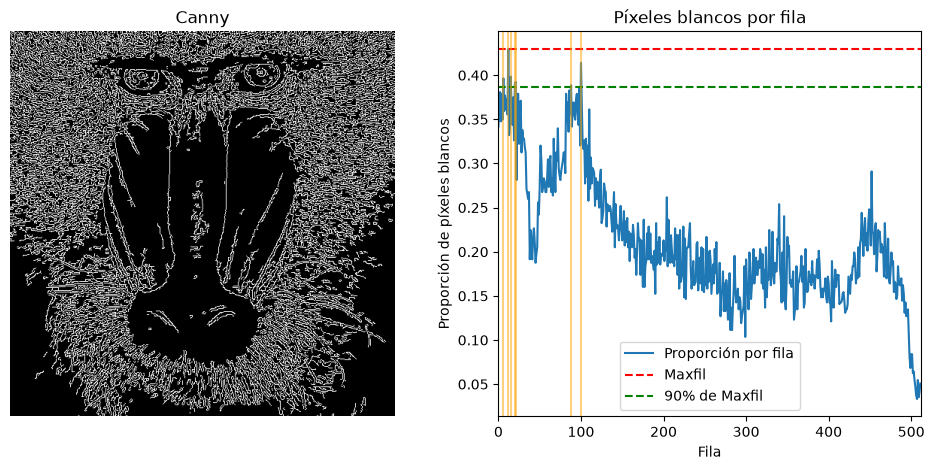
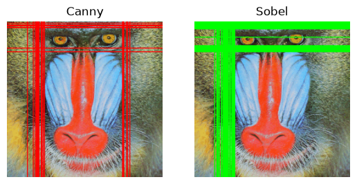

# Descripción

Este repositorio contiene una serie de ejercicios prácticos realizados en Python utilizando la biblioteca OpenCV, enfocados en el procesamiento y manipulación de imágenes. Las tareas desarrolladas incluyen:

- Determinar los píxeles blancos de la imagen por filas.
- Determinar las filas y columnas con el máximo de número de pixeles blancos aplicando umbralizado a la imagen.
- Propuesta de interpretación de la imagen inspirada en distintos videos.

Cada celda del [cuaderno](/p2/P2_Tareas.ipynb) está comentada para explicar su propósito y facilitar la comprensión del código.

---

# Contenido

Para el desarrollo de la práctica necesitamos las siguientes librerías:

```py
import cv2
import numpy as np
import matplotlib.pyplot as plt
from PIL import Image, ImageDraw, ImageFont
```

- OpenCV: Uso de las funciones para el tratamiento de imágenes.
- Numpy: Ayuda en operaciones matemáticas y filtrado.
- Matplotlib: Exponer resultados.
- PIL: Dibujo sobre imágenes.

**Primera Tarea:** Realiza la cuenta de píxeles blancos por filas (en lugar de por columnas). Determina el valor máximo de píxeles blancos para filas, maxfil, mostrando el número de filas y sus respectivas posiciones, con un número de píxeles blancos mayor o igual que 0.90*maxfil. Resalta con alguna primitiva que cumplen dicha condición

Para el desarrollo de esta tarea se nos presta la imagen clásica para visión por computador del mandril.

```py
img = cv2.imread('mandril.jpg') #para leer la imagen
gris = cv2.cvtColor(img, cv2.COLOR_BGR2GRAY) # converitmos la imagen a gris
canny = cv2.Canny(gris, 100, 200) #es para identificar los bordes de la imagen, ya que funciona solo cpn el escalado en gris
count_rows = cv2.reduce(canny, 1, cv2.REDUCE_SUM, dtype=cv2.CV_32SC1) #suma las filas 
rows = count_rows[:] / (255 * canny.shape[1]) #esta normalizando,  es decir haciendolo mas peque;o  para que se muestre en la grafica
```

Leemos la imagen usando `cv2.imread()` y la pasamos a escala de grises. El método Canny para la detección de bordes necesita trabajar sobre grises. Seguidamente aplicamos Canny con umbrales 100 y 200, y el resultado será una imagen que tendrá blanco en píxeles que sean identificados como bordes y negro en los que no.

Por último usamos la función `cv2.reduce()` para sumar las filas de la matriz de la imagen resultante. Esto significa que tendremos una sumatoria de todos los píxeles de borde por columna. La varibale _rows_ es la normalización de los valores (muy grandes), siendo ahora valores entre 0 y 1.

```py
maxfil = rows.max() # la mayor proporcion encontrada en cualquier file
umbral = maxfil * 0.9 #aqui calculamos el umbral
filas_destacadas = np.where(rows >= umbral)[0] # indice (numero de fila) cuya proprición >= umbral
print(f"Valor máximo de píxeles blancos en una fila (maxfil): {maxfil}")
print(f"Filas con al menos el 90% de maxfil ({umbral} píxeles): {filas_destacadas}")
```

Obtenemos del anterior vector, el valor que cumpla con el umbral proporcionado en el enunciado. Para ello calculamos el valor máximo de bordes en el vector.

```py
plt.figure(figsize=(12,5))

plt.subplot(1, 2, 1) # crea un lienzo con una fila y 2 columnas
plt.axis("off") # oculta los ejes para mostrar solo la imagen
plt.title("Canny") #titulo
plt.imshow(canny, cmap='gray') #muestra la imagen en escala de grises

plt.subplot(1, 2, 2) # en la imagen de la derecha
plt.title("Píxeles blancos por fila")
plt.xlabel("Fila")
plt.ylabel("Proporción de píxeles blancos")
plt.plot(rows, label="Proporción por fila") #dibuja la curva de rows

plt.axhline(maxfil, color="red", linestyle="--", label="Maxfil") # una linea roja horizontal en proporcion a la maxima encontrada
plt.axhline(0.9*maxfil, color="green", linestyle="--", label="90% de Maxfil")# una linea verde horizontal en el 90% de esa proporicon

for f in filas_destacadas: # dibuja lineas verticales en las filas que superarion el umbral 
    plt.axvline(f, color="orange", alpha=0.5)
plt.xlim([0, canny.shape[0]])
plt.legend()
plt.show()
```

Exponemos el resultado usando la librería Matplotlib. En subplot ponemos la imagen y en otro el gráfico. Se marcan los umbrales con lineas horizontales y con verticales se muestran las filas que superaron el umbral exigido.

```py
Valor máximo de píxeles blancos en una fila (maxfil): 0.4296875
Filas con al menos el 90% de maxfil (0.38671875 píxeles): [  6  12  15  20  21  88 100]
```



Podemos finalmente observar las filas que superan el umbral especificado y el nivel de píxeles blancos por filas.

**Segunda Tarea:** Aplica umbralizado a la imagen resultante de Sobel (convertida a 8 bits), y posteriormente realiza el conteo por filas y columnas similar al realizado en el ejemplo con la salida de Canny de píxeles no nulos. Calcula el valor máximo de la cuenta por filas y columnas, y determina las filas y columnas por encima del del 0.90*máximo. Remarca con alguna primitiva gráfica dichas filas y columnas sobre la imagen del mandril. Visualiza los resultados obtenidos para la imagen (o una de tu elección) con Canny y Sobe tras umbralizar. ¿Cómo se comparan los resultados obtenidos a partir de Sobel y Canny?

En este ejercicio se compararán los dos métodos de detección, Sobel y Canny. Para empezar debemos adaptar la imagen al uso de Sobel, umbralizamos y comparamos el resultado.

```py
img_rgb = cv2.cvtColor(img, cv2.COLOR_BGR2RGB) # convierte a RGB
gris = cv2.cvtColor(img, cv2.COLOR_BGR2GRAY)# convierte a gris
canny = cv2.Canny(gris, 100, 200) 

# análisis Canny original
col_counts_canny = cv2.reduce(canny, 0, cv2.REDUCE_SUM, dtype=cv2.CV_32SC1)
cols_canny = col_counts_canny[0] / (255 * canny.shape[0])
#suma sobre filas, resultado = cantidad de píxeles blancos por columna.
row_counts_canny = cv2.reduce(canny, 1, cv2.REDUCE_SUM, dtype=cv2.CV_32SC1)
rows_canny = row_counts_canny[:, 0] / (255 * canny.shape[1])
#suma sobre columnas, resultado = cantidad de píxeles blancos por fila.
```

Recuperamos los valores de Canny: convertimos la imagen a grises, usamos la reducción por suma y normalizamos tanto en columnas como filas.

```py
# procesamiento sobel
ggris = cv2.GaussianBlur(gris, (3, 3), 0)# suavizar los bordes
sobelx = cv2.Sobel(ggris, cv2.CV_64F, 1, 0)  #  gradiente en X
sobely = cv2.Sobel(ggris, cv2.CV_64F, 0, 1)  # gradiente en Y
sobel = cv2.add(sobelx, sobely) #combina ambos
sobel8 = cv2.convertScaleAbs(sobel)
```

Suavizamos los bordes de la imagen usando el método Gaussiano en matrices. Esto es debido a que Sobel se descontrolaría bastante ya que es más sensible.

```py
# umbralizado de sobel
valorUmbral_sobel = 50  # valor ajustado para Sobel
_, sobel_umbral = cv2.threshold(sobel8, valorUmbral_sobel, 255, cv2.THRESH_BINARY)# umbraliza para quedanos con pixeles fueres

# conteo por columnas y filas para sobel umbralizado
col_counts_sobel = cv2.reduce(sobel_umbral, 0, cv2.REDUCE_SUM, dtype=cv2.CV_32SC1)
cols_sobel = col_counts_sobel[0] / (255 * sobel_umbral.shape[0])

row_counts_sobel = cv2.reduce(sobel_umbral, 1, cv2.REDUCE_SUM, dtype=cv2.CV_32SC1)
rows_sobel = row_counts_sobel[:, 0] / (255 * sobel_umbral.shape[1])
```

Realizamos el umbralizado usando un valor umbral arbitrario. Con `cv2.treshold()` aplicamos este valor umbral a la imagen de Sobel, que nos dará como resultado la imagen con blancos y negros dependiendo si se ha superado el umbral o no. Posteriormente, sumamos las columnas y filas y normalizamos los valores.

```py
max_col_canny = np.max(cols_canny)
max_row_canny = np.max(rows_canny)
umbral_col_canny = 0.90 * max_col_canny
umbral_row_canny = 0.90 * max_row_canny

max_col_sobel = np.max(cols_sobel)
max_row_sobel = np.max(rows_sobel)
umbral_col_sobel = 0.90 * max_col_sobel
umbral_row_sobel = 0.90 * max_row_sobel
```

Encontramos los máximos de cada uno de los métodos, tanto en columnas como en filas.

```py
cols_destacadas_canny = np.where(cols_canny > umbral_col_canny)[0]
rows_destacadas_canny = np.where(rows_canny > umbral_row_canny)[0]

cols_destacadas_sobel = np.where(cols_sobel > umbral_col_sobel)[0]
rows_destacadas_sobel = np.where(rows_sobel > umbral_row_sobel)[0]
```

Apoyándose en la librería NumPy podemos encontrar con `np.where()` los valores que superen el umbral para ser destacados.

```py
# crear imágenes con marcas
img_marked_canny = img_rgb.copy()
img_marked_sobel = img_rgb.copy()

# marcar líneas destacadas en Canny (rojo)
for col in cols_destacadas_canny:
    cv2.line(img_marked_canny, (col, 0), (col, img_marked_canny.shape[0]), (255, 0, 0), 2)
for row in rows_destacadas_canny:
    cv2.line(img_marked_canny, (0, row), (img_marked_canny.shape[1], row), (255, 0, 0), 2)

# marcar líneas destacadas en Sobel (verde)
for col in cols_destacadas_sobel:
    cv2.line(img_marked_sobel, (col, 0), (col, img_marked_sobel.shape[0]), (0, 255, 0), 2)
for row in rows_destacadas_sobel:
    cv2.line(img_marked_sobel, (0, row), (img_marked_sobel.shape[1], row), (0, 255, 0), 2)
```

Copiamos las imágenes y sobre ellas dibujamos las líneas que representan las filas y columnas que se han obtenido del umbralizado y del uso del método Canny. Esto es la comparación en sí.

```py
# visualización completa
plt.figure()

plt.subplot(1,2,1)
plt.axis("off")
plt.title("Canny")
plt.imshow(img_marked_canny, cmap='gray')

plt.subplot(1,2,2)
plt.axis("off")
plt.title("Sobel")
plt.imshow(img_marked_sobel, cmap='gray')

plt.show()

print("Máximo de filas Sobel", max_row_sobel)
print("Máximo de filas Canny", max_row_canny)

print("Máximo de columnas Sobel", max_col_sobel)
print("Máximo de columnas Canny", max_col_canny)
```



Obtenemos una comparativa de filas entre el método Canny y Sobel. Se observa que Canny cumple de manera más precisa con la detección de bordes y Sobel detecta más cantidad de puntos.

**Tercera Tarea:** Tras ver los vídeos proponer un demostrador reinterpretando la parte de procesamiento de la imagen, tomando como punto de partida alguna de dichas instalaciones.

Para esta tarea se propone un demostrador propio: una "cortina de privacidad" virtual. La cámara detecta en qué columnas de la imagen hay movimiento y, solo en esas columnas, oscurece el vídeo y dibuja encima los bordes del fondo aprendido, simulando una cortina semitransparente que tapa justo la zona donde hay actividad. Se reutiliza la misma lógica de conteo por filas/columnas de las tareas anteriores (`cv2.reduce()` + umbralizado), pero aplicada ahora a una máscara de movimiento en vez de a los bordes de Canny/Sobel.

```py
def crea_eliminador_fondo():
    return cv2.createBackgroundSubtractorMOG2(history=100, varThreshold=50, detectShadows=True)
```

Definimos una función que crea el sustractor de fondo MOG2 (Mixture of Gaussians). Este algoritmo aprende, a lo largo de varios fotogramas, un modelo estadístico del aspecto "normal" del fondo, y marca como primer plano (blanco) los píxeles que se desvían de ese modelo. `history=100` indica cuántos fotogramas pasados influyen en el modelo de fondo, `varThreshold=50` regula la sensibilidad a la desviación, y `detectShadows=True` hace que MOG2 marque las sombras en un gris intermedio en vez de en blanco, para poder descartarlas después.

```py
def columnas_con_movimiento(mascara, umbral_actividad=0.05):
    alto, ancho = mascara.shape
    col_counts = cv2.reduce(mascara, 0, cv2.REDUCE_SUM, dtype=cv2.CV_32SC1)[0]
    fracciones = col_counts / (255 * alto)
    return fracciones >= umbral_actividad
```

Esta función es el mismo patrón que usamos en las tareas anteriores para contar píxeles de borde por fila o columna, pero aquí lo aplicamos sobre la máscara de movimiento. `cv2.reduce(mascara, 0, cv2.REDUCE_SUM, ...)` suma los valores por columnas, igual que hacíamos con Canny y Sobel. Dividimos entre `255 * alto` para normalizar el resultado a una fracción entre 0 y 1, y comparamos contra el umbral de actividad para quedarnos con un array booleano. Es True en las columnas donde hay suficiente movimiento.

```py
def aplica_cortina(frame, bordes_fondo, columnas_tapadas, oscurecido=0.15):
    salida = frame.copy()
    bordes_color = cv2.cvtColor(bordes_fondo, cv2.COLOR_GRAY2BGR)
    for x, tapada in enumerate(columnas_tapadas):
        if tapada:
            salida[:, x] = (salida[:, x] * oscurecido).astype(np.uint8)
            salida[:, x] = cv2.add(salida[:, x], bordes_color[:, x])
    return salida
```

Aquí aplicamos el efecto visual de la cortina. Para cada columna marcada como "tapada", multiplicamos sus valores de píxel por 0.15, oscureciéndola al 15% de su brillo original (no la ponemos a negro total para conservar algo de profundidad). Después le sumamos los bordes del fondo aprendido en esa misma columna con `cv2.add`, que hace una suma saturada sin desbordarse por encima de 255. El resultado es que las zonas con movimiento se ven oscurecidas, mostrando solo el contorno del fondo estático, como si se mirara a través de una cortina semitransparente.

```py
vid = cv2.VideoCapture(0)
eliminador = crea_eliminador_fondo()

while True:
    ret, frame = vid.read()
    if ret:
        framem = cv2.flip(frame, 1)

        # movimiento genérico (sin interpretar qué es), descartando sombras
        mascara = eliminador.apply(framem)
        _, mascara = cv2.threshold(mascara, 200, 255, cv2.THRESH_BINARY)
        kernel = np.ones((5, 5), np.uint8)
        mascara = cv2.morphologyEx(mascara, cv2.MORPH_OPEN, kernel)

        # bordes del fondo aprendido por MOG2, para dibujar sobre las zonas tapadas
        fondo = eliminador.getBackgroundImage()
        bordes_fondo = cv2.Canny(cv2.cvtColor(fondo, cv2.COLOR_BGR2GRAY), 50, 150) if fondo is not None else np.zeros(framem.shape[:2], np.uint8)

        # columnas con actividad suficiente -> se tapan, como la cortina física
        columnas_tapadas = columnas_con_movimiento(mascara)

        # aplica el efecto de cortina
        salida = aplica_cortina(framem, bordes_fondo, columnas_tapadas)

        cv2.imshow('Cortina de privacidad', salida)
        cv2.imshow('Movimiento detectado', mascara)

    tecla = cv2.waitKey(20)
    if tecla == 27:          # ESC
        break
    if tecla == ord('b'):    # reinicia el fondo
        eliminador = crea_eliminador_fondo()

vid.release()
cv2.destroyAllWindows()
```

En el bucle principal capturamos el vídeo y aplicamos `cv2.flip(frame, 1)` para voltearlo horizontalmente, de modo que el movimiento en pantalla coincida con el movimiento real de quien está frente a la cámara (efecto espejo). Aplicamos el sustractor de fondo sobre el fotograma volteado para obtener la máscara de movimiento, y la umbralizamos a 200 para descartar las sombras que MOG2 marca en gris. Después usamos una apertura morfológica (`cv2.MORPH_OPEN`) para limpiar el ruido puntual de la máscara sin perder las zonas de movimiento real.

Recuperamos el fondo aprendido por MOG2 con `getBackgroundImage()` y le aplicamos Canny para extraer sus contornos, que son los que se dibujan sobre las columnas tapadas. Calculamos qué columnas tienen suficiente movimiento con la función anterior y aplicamos el efecto de cortina sobre el fotograma.

Finalmente mostramos tanto el resultado con la cortina como la máscara de movimiento detectado, por separado, para poder comprobar que la detección funciona correctamente. El programa termina al pulsar ESC, y la tecla 'b' permite reiniciar el modelo de fondo si este cambia de verdad y deja de representar correctamente la escena estática.

<video controls src="/p2/t3.mp4" title="video de la tarea 3"></video>

---

# Autoría

Este trabajo ha sido realizado por _Paula Lijun Nuez Hernández_ del grupo 25, como parte de una práctica de procesamiento de imágenes en el entorno académico.

---

# Bibliografía

Se han utilizado las siguientes fuentes durante el desarrollo de la práctica:

- [Documentación oficial OpenCV](https://docs.opencv.org)
- Vídeo "[My little piece of privacy](https://www.niklasroy.com/project/88/my-little-piece-of-privacy)"
- Vídeo "[Messa di voce](https://youtu.be/GfoqiyB1ndE?feature=shared)"
- Vídeo "[Virtual air guitar](https://youtu.be/FIAmyoEpV5c?feature=shared)"
- Consultas a [Gemini](https://share.gemini.google/4MRLj8EUQvIH)
